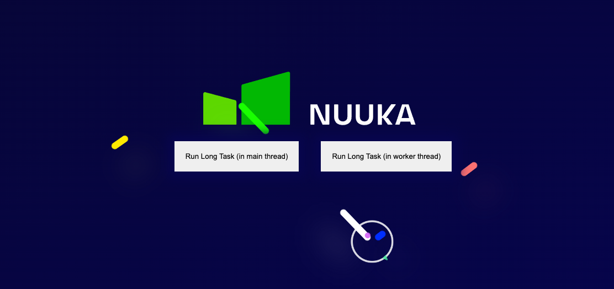

# Web Workers; a simple demo - making the UI fluid again

A simple demo to demonstrate how to shift data processing from the main thread and improve the UI from a UX perspective.



## To get started

```
yarn install # or npm install
yarn serve ./
```

Then visit [http://localhost:3000](http://localhost:3000).

Click on either of the "Run Long Task" buttons. One will run it in the main javascript thread. You should see some animations blocked and frozen. Clicking on the other button should not block any of the animations and demonstrate a simple principal about how to shift data processing to a worker is better for the UI.

## Further Reading

- [Using web workers](https://developer.mozilla.org/en-US/docs/Web/API/Web_Workers_API/Using_web_workers)
- [Web Worker API](https://developer.mozilla.org/en-US/docs/Web/API/Worker)
